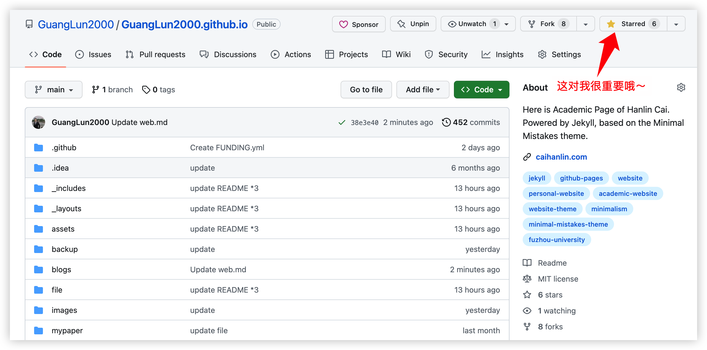
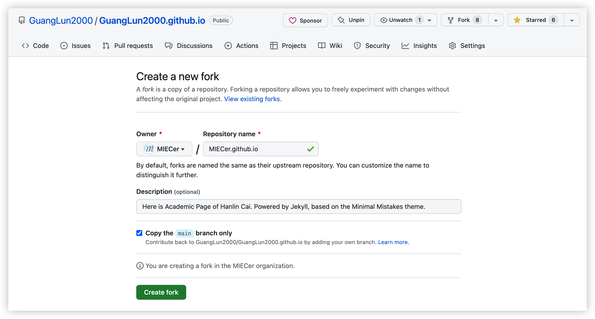
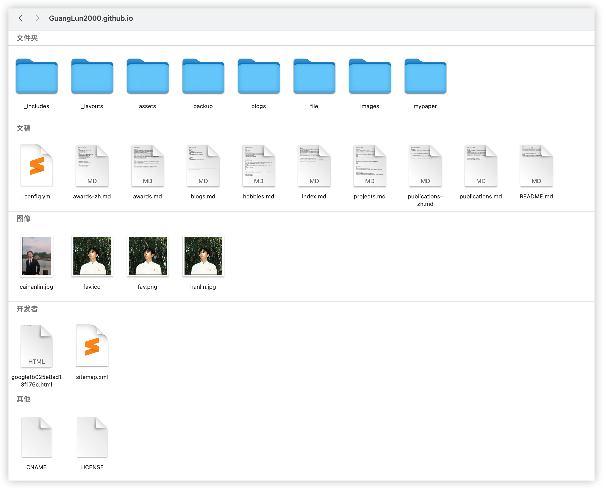

## 建站完全指南

> Philosophy：极简、高效、免费

<center>
  
</center>
<br>本站点自2022年12月正式发布以来，经历了2次重大修改，如今的单月访客量达到200多，在此感谢各位访客朋友的支持！与此同时，许多朋友也开始通过各种形式来咨询笔者——**如何搭建属于自己的轻量化主页？**

<br>刚开始还可以腾出时间仔细解答，但随着访客愈多，前来咨询的同学越来越多，然而笔者学业繁重，实在是应接不暇，非常抱歉！因此，为了方便各位朋友复刻本站点，笔者趁五一休假完成了这份小白建站完全指南，希望可以帮助读者朋友搭建一个**极简、高效、免费的Jekyll个人网站**。

---

### (0) 核心工具

在开始之前，首先介绍一下本站所依赖的核心工具

- [Jekyll](https://www.jekyll.com.cn/)：一个简单的静态网站生成器
- [Minimal Mistakes](https://mademistakes.com/)：本站所采用的极简风主题
- [Github Page](https://docs.github.com/zh/pages)：GitHub所提供的一个网页寄存服务

此外，本站配置了一些附加的小功能，调用第三方服务接口即可实现

- Calendly 线上聊天预约
- Disqus 站点留言功能
- Counter 访客记录
- Clustrmaps 访客分布动态地球仪

<center>

</center>

## 正文部分

能够看到这篇博客，说明你已经实现了**科学上网**，因此这里假设诸位读者朋友均可以正常访问[Github](https://github.com/GuangLun2000/GuangLun2000.github.io)，后续我们将采用最简单的**Github fork流程**进行指导，请确保你的每一步都准确按照流程。

### (1) 前期配置

接下来，我们先进行前期环境配置工作。**万事开头难**，读工科的同学都知道，往往配置代码编译环境是最繁琐的。一旦完成，后续的工作流将会非常顺滑，接下来请大家务必按照以下流程进行操作：

- 点击进入[Github官网](https://github.com/signup)，进行账号注册，建议使用非常用邮箱进行注册
- **可选项：**下载[Github Desktop](https://desktop.github.com/)，强烈建议小白下载，以减轻后续负担
- 关于Github Desktop如何使用，请参考[官方中文文档](https://docs.github.com/zh/desktop)
- 完成注册及下载后，请进入本站的代码仓库[GuangLun2000.github.io](https://github.com/GuangLun2000/GuangLun2000.github.io)



<br>完成上述前置工作后，接下来，我们来复制网站代码运行仓库，这也是最关键的步骤之一，请务必细心：

- ~~首先，点击右上角的Starred，为我助力~~
- **关键步骤：**点击右上角的Fork，进入配置界面
- Repository name配置为：[你的用户名].github.io
- **注意：**配置用户名和仓库名需要大小写一致！
- 勾选Copy the `main` branch only（只需要复制项目主支即可）
- 最后，点击Create fork，完成代码仓库复制 🎉



<br>到此为止，基本的工作已经完成一半了，如果在上面的步骤中出现了任何简单问题，请学会`STFW (Search The Friendly Web)`

---

### (2) 文件解释

下面，我们开始针对仓库内容进行定制化的修改。首先需要向各位解释，**根目录下各个文件的作用：**

```bash
.根目录
├── _config.yml  最关键的配置文件，所有的修改都将基于.yml展开
├── ***.md       主文件夹下的.md文件，构成了网站上的每一个界面
├── CNAME        用于配置个人域名，例如我的域名是caihanlin.com，而不是.github.io（可选配）
├── LICENSE      协议文件，MIT协议表示本代码仓库可以被免费、无偿地复刻（可选配）
├── sitemap.xml  实际上改不改这个文件，都不会影响网站的正常显示（可选配）
├── googlefb025e8ad13f176c.html        用于配置Google搜索（可选配）
```

<br>**然后，介绍一下各个“子文件夹”的功能作用：**

```bash
.根目录
├── _includes 构成本网站的html代码，不建议修改
├── _layouts  构成本网站的html代码，不建议修改
├── assets    美化本网站的css,less,js代码，不建议修改
├── backup    用于备份文件，以便于后续修改时可以参考
├── blogs     存放个人博客.md文件，以及对应的图片素材
├── file      存放简历CV等个人文件，用于设置访问链接
├── images    存放.jpg等媒体文件，用于设置访问链接
├── mypaper   存放个人学术文章，用于设置访问链接
```



---

### (3) 个性化修改

理解了每个文件对应的功能之后，再进行个性化的修改，就变得容易许多了。大家可以注意到，其实当你fork完代码仓库，等待一段时间后，访问 `[你的用户名].github.io` 这个域名，此时网站已经可以运行了，只不过显示的还是笔者的网站内容。

<br>因此，接下来需要进行个性化的修改。需要注意的是，在这里笔者并不会教大家，每个文件的具体配置——而是教你如何修改主要的文件，其他的则需要你自行按图索骥，举一反三。

<br>首先我们修改`index.md`文件，也就是网站的主界面，在文本编辑完成后，使用`Github Desktop`上传到你的`github仓库`，一切正常的话，1-2分钟过后，你的网站就会发生变化了 🎉 

<br>


<br>接下来，介绍`_config.yml`文件的配置方法，`.yml`是Jekyll静态站点的核心文件，核心的部分如下，其他的内容展示都先不用修改。笔者在`.yml`文件中已经撰写了比较详细的注释，如果还是不太清楚的话，建议`STFW (Search The Friendly Web)`

```yaml
title: Hanlin Cai
url: https://caihanlin.com

owner: 
  name: Hanlin Cai
  avatar: hanlin.jpg (根目录下的图片)
  email: hanlin.cai@ieee.org
  github: GuangLun2000（只需要输入用户名即可）
  linkedin: hanlin-cai-07b53b23b（只需要ID即可）

links:
  - title: About Me（可依照个人需求修改，下同）
    url: /
  - title: Publications
    url: /publications/
  - title: Projects
    url: /projects/
```

<br>恭喜你已经学会了最关键的部分，完成了80%的工作，之后的内容编辑你应该可以举一反三，得心应手了 🎉 接下来，笔者还会针对一些重要的细节进行指导，这些细节都将在后续网站的运营过程中帮助你减少工作量，希望你可以认真看下去哦。

---

### (4) 链接配置


<p align="right">2023/04/27</p>
